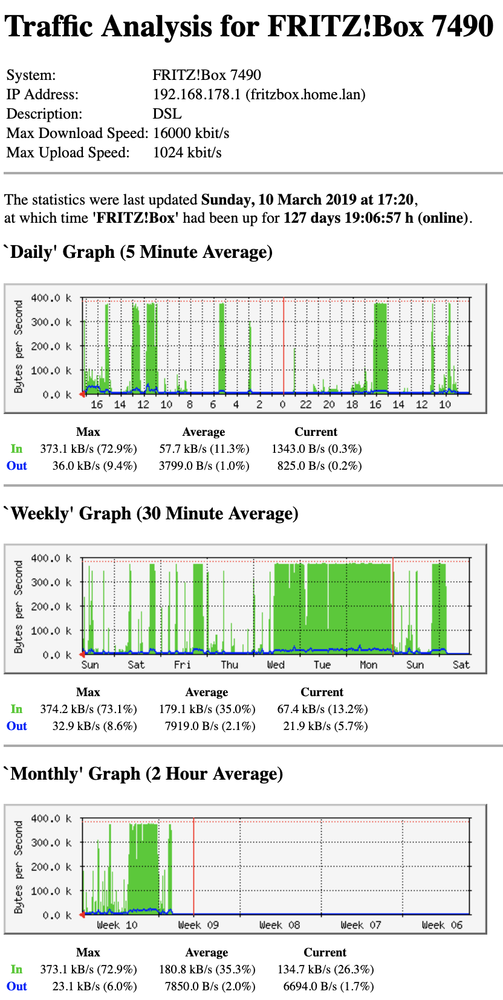

# fritzbox-bandwidth-monitor
Monitor your fritz.box with mrtg using docker

Build:
````
docker build -t fritzbox-bandwidth-monitor .
````

Run with "docker":
```
docker run -d -p 80:80 fritzbox-bandwidth-monitor 
````
or (in case you want to persist the HTML output and log):
```
mkdir -p /home/pi/fritzbox/html
docker run -d -v /home/pi/fritzbox/html:/var/www/html --restart always -p 80:80 fritzbox-bandwidth-monitor
```

Or using docker-compose:
```
  fritzbox-bandwidth-monitor:
    image: fritzbox-bandwidth-monitor
    container_name: fritzbox-bandwidth-monitor
    ports:
      - 80:80
    restart: unless-stopped
```

Point your Browser to http://localhost/fritzbox.html and view your traffic stats. Cron runs every five minutes and updates the html data within the container.



Other fritzbox related monitoring projects:
https://github.com/Tafkas/fritzbox-munin 

